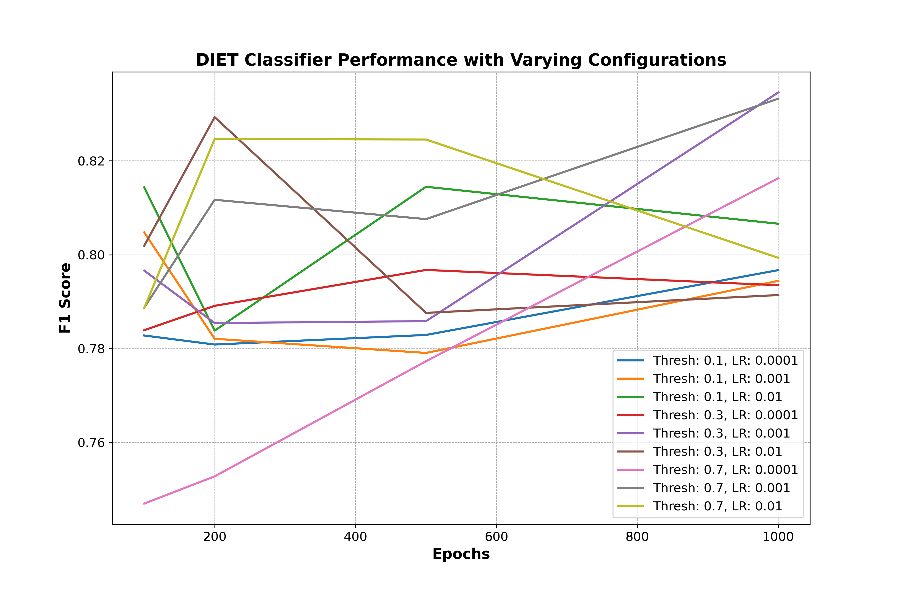
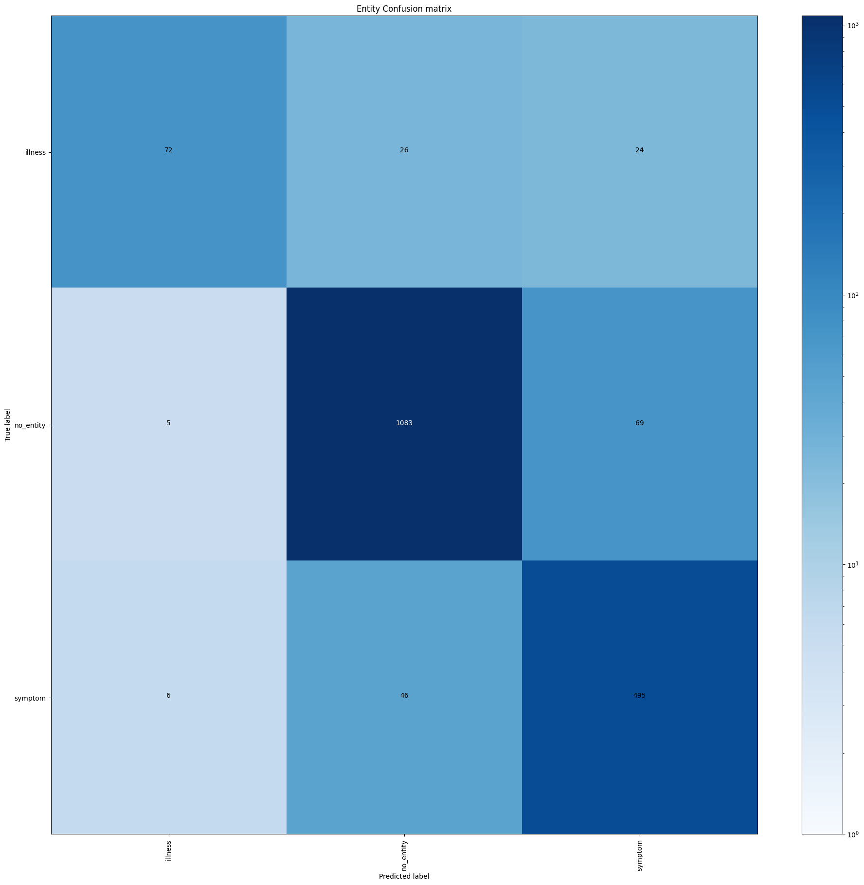
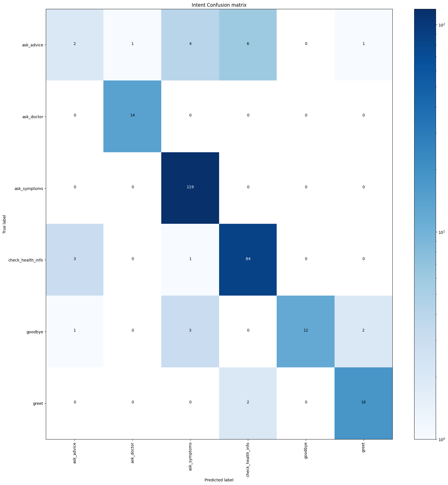

# Health Assistant Chatbot


This repository demonstrates how to build a customized AI chatbot designed to provide basic medical advice. The chatbot is intended for demonstration purposes only and should not be used as a substitute for professional medical advice, diagnosis, or treatment.

## Table of Contents

- [Chatbot Demonstration](#chatbot-demonstration)
- [Dataset](#dataset)
- [Project Structure](#project-structure)
- [Usage](#usage)
- [Modeling](#modeling)
- [Evaluation](#evaluation)
- [Results](#results)
- [Disclaimer](#disclaimer)
- [Contributing](#contributing)
- [License](#license)

## Chatbot Demonstration

Below is a snapshot of the Health Assistant Chatbot running in `index.html`:


The chatbot interface includes a welcome message, a disclaimer about its use for demonstration purposes only, and a link to the developer's GitHub profile.

## Dataset

The dataset used in this project, which includes health-related data and symptom-to-illness mappings, was sourced from [Mendeley Data](https://data.mendeley.com/datasets/dv5z3v2xyd/1). 

The dataset is utilized not for direct prediction but as a reference table to infer possible illnesses based on user-reported symptoms.

### Citation of the Dataset

The `medical_corpus.yml` file contains hand-crafted conversations specifically designed for this project. If you use this repository, please cite it appropriately.

## Project Structure

```plaintext
Health_Assistant_Chatbot/
├── actions/
│   ├── actions.py                      # Contains custom action code for Rasa chatbot
├── data/
│   ├── Healt_advice_for_Illnesses.csv  # Data with health advice based on symptoms
│   ├── nlu.yml                         # Contains NLU training data
│   ├── rules.yml                       # Rules for the chatbot's behavior
│   ├── stories.yml                     # Stories to train the dialogue model
│   ├── symbipredict_2022.csv           # Table to infer possible illnesses based on user-reported symptoms
├── scripts/
│   ├── fine_tuning_model.py            # Script to fine-tune the chatbot model
│   ├── new_entries.py                  # Script to add new entries to the dataset
├── models/
│   ├── chatbot_model.tar.gz            # Trained chatbot model
├── results/  
│   ├── DIETCLassifier_confusion_matrix.png  # Confusion matrix for DIET Classifier
│   ├── DIETCLassifier_histogram.png         # Histogram for DIET Classifier performance
│   ├── intent_confusion_matrix.png          # Confusion matrix for intent recognition
│   ├── intent_histogram.png                 # Histogram for intent recognition performance
│   ├── performance_plot.png                 # Performance plot of the model
│   ├── nlu_test_results.csv                 # Test results for the NLU component
├── test/
│   ├── test_stories.yml                # Test stories for validating the chatbot
├── background.png                      # Background image for the chatbot interface
├── config.yml                          # Configuration for Rasa model
├── credentials.yml                     # Credentials for connecting the chatbot to messaging platforms
├── domain.yml                          # Domain file defining intents, entities, and slots
├── endpoints.yml                       # Endpoints configuration for action server
├── index.html                          # Web interface for the chatbot
├── README.md                           # Project README
├── requirements.txt                    # Python dependencies
```

## Usage

1. **Fine-Tuning the Model**:
   - Use the `fine_tuning_model.py` script to fine-tune the chatbot model with the latest data.
   - [Fine-Tuning Script](scripts/fine_tuning_model.py)

2. **Adding New Entries**:
   - Add new health-related entries to the dataset using the `new_entries.py` script.
   - [New Entries Script](scripts/new_entries.py)

3. **Running the Chatbot**:
   - Run the chatbot locally by executing the following command:
     ```bash
     rasa run actions --debug
     rasa run --enable-api --cors "*" --debug
     ```

4. **Testing the Chatbot**:
   - Validate the chatbot's responses by using the test stories provided in the `test_stories.yml` file.

## Modeling

The project uses the Rasa framework to build and train the chatbot. The chatbot is trained with a custom medical corpus (`nlu.yml`) that includes a variety of common medical inquiries and responses.

### Example Medical Corpus

The `nlu.yml` includes conversations like:

- intent: ask_symptoms
  examples: |
    - I have [phlegm](symptom), [cough](symptom), [headache](symptom), [fever](symptom) and [sore throat](symptom)
    - My symptoms include [nausea](symptom) and [vomiting](symptom)
    - I'm feeling [dizzy](symptom) with a [high fever](symptom)|
      
- intent: ask_advice
  examples: |
    - What should I take for a [headache](symptom)?
    - How do I relieve [back pain](symptom)?
    - Any suggestions for a [sore throat](symptom)?

### Actions Description

The `actions.py` script plays a crucial role in enhancing the capabilities of the chatbot by integrating external APIs, natural language processing (NLP) techniques, and customized logic to handle user interactions effectively.

1. **GPT-Neo Integration for Unknown Responses**:
   - The chatbot uses a free GPT-Neo 2.7B model via the Hugging Face API to generate responses for inputs that the model does not recognize or cannot handle directly. This allows the chatbot to provide meaningful responses even when it encounters unexpected user input.
   - Alternatively, the script can be modified to run a local GPT-Neo server, which involves loading the model and tokenizer directly using the `transformers` library. This setup offers greater control over the response generation process but requires significant computational resources.

2. **Symptom Analysis and Health Advice**:
   - The script includes actions like `SymptomAnalysisAction`, which analyzes user-reported symptoms against a dataset (`symbipredict_2022.csv`) to predict possible illnesses. This action uses NLP techniques to normalize user input and match it against known symptoms in the dataset.
   - The `ActionProvideIllnessAdvice` and `ActionProvideHealthInfo` actions offer health advice and detailed information about specific illnesses based on another dataset (`Health_Advice_for_Illnesses.csv`). These actions help the chatbot provide contextually relevant advice and information to users.

3. **Custom Notifications and Fallbacks**:
   - Actions like `ActionNotifyResponseGeneration` and `Simple_GPT_Action` are used to inform users when the system is generating a response or when fallback handling is required. These actions improve the user experience by providing feedback during potentially longer processing times.

Overall, the `actions.py` script significantly enhances the chatbot's ability to handle complex interactions and provide valuable health-related information to users, making it a powerful tool for demonstrating the potential of AI-driven health assistants.


## Evaluation

Model performance is assessed using metrics such as:

- Accuracy
- Precision
- Recall
- F1-Score

### Fine-Tuning the DIET Classifier

The chatbot's DIET classifier was fine-tuned by experimenting with various configurations of epochs, thresholds, and learning rates to optimize its performance. The goal was to identify the best combination of these hyperparameters that would yield the highest F1 score, indicating a well-balanced model in terms of precision and recall.

#### Configurations Tested

The following configurations were tested:

- **Epochs**: 100, 200, 500, 1000
- **Thresholds**: 0.1, 0.3, 0.7
- **Learning Rates**: 0.01, 0.001, 0.0001

For each configuration, the DIET classifier was trained and evaluated using cross-validation. The F1 scores were calculated and logged for analysis.
The results of these experiments were plotted to visualize the impact of varying the hyperparameters on the model's performance. The following plot illustrates the F1 scores achieved with different combinations of epochs, thresholds, and learning rates:



## Results

### Confusion Matrices





### Evaluation Metrics

The table below summarizes the performance of the model on the test set, detailing the accuracy, precision, recall, and F1-Score.

| Metric    | Value   |
|-----------|---------|
| Accuracy  | 0.95    |
| Precision | 0.96    |
| Recall    | 0.94    |
| F1-Score  | 0.95    |

The performance metrics indicate that the model performs well in predicting intents and entities, with high scores across all metrics.

### Conclusion

The chatbot demonstrates robust performance in understanding and responding to user inputs related to health inquiries. However, some misclassifications occur, as highlighted in the confusion matrices, suggesting areas for further improvement, such as refining entity recognition and intent classification.

Overall, the health assistant chatbot is effective in providing health-related advice and information. Future improvements could focus on expanding the dataset and refining the model to handle a broader range of inquiries and reduce misclassification rates.

## Contributing

Contributions are welcome! Please create an issue or submit a pull request for any feature requests or improvements.

## License

This project is licensed under the MIT License.

If you use this repository in your research, please cite it as shown in the right sidebar.
